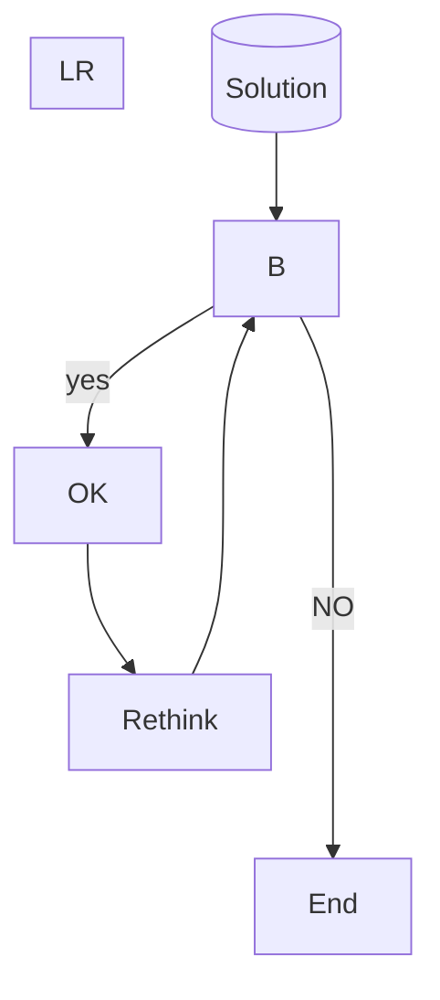
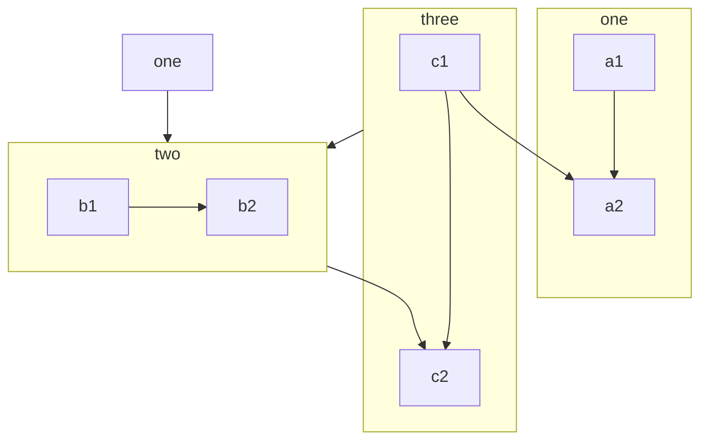

```mermaid
	graph TB
		Pj[(Solution)]--> B
		
	B --yes-->C[OK];
		C -->D[Rethink];
		D --> B;
		B ---->|NO| E[End];
		
		subgraph LR 
			
		end  
		
		
```

```mermaid
	flowchart TB 
	c1-->a2 
	subgraph one 
	a1-->a2 
	end
	subgraph two
		b1-->b2 
	end
	subgraph three
		c1-->c2 
	end 
	one --> two
	three --> two
	two --> c2
```