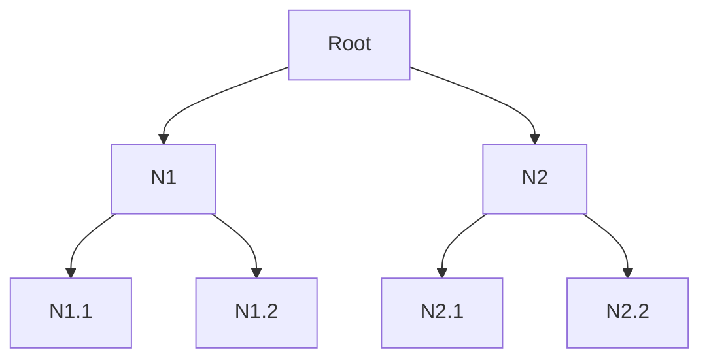
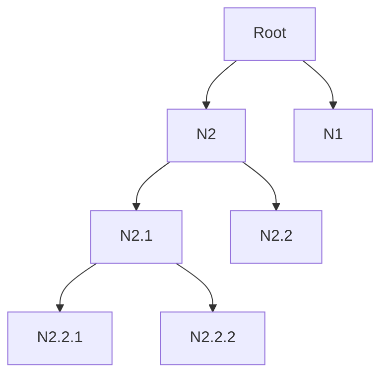
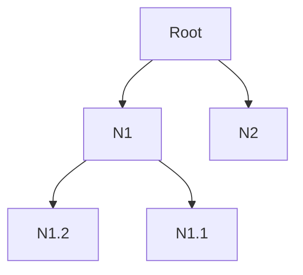

Types of Binary Trees:

# Full Binary Tree
has 0 or 2 children. We can also say a full binary tree is a binary tree in which all nodes except leaf nodes have two children.

1.

2.

3.

# Complete Binary Tree
