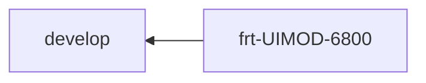

#flexbricks 

1. Create for develop branch `featch`
2. Do for develop branch pull
3. Checkout for the branch with name like frt-[name of the item]
	``Example: ftr-UIMOD-6800``
4. Add fixes
5. Create commit 

```ad-success
title: Commit message example
collapse: closed
UIMOD-6800 : Image Catalog > Save Search - 'Show / Hide' for search is shifted to the 2nd row

 - make cell size smaller
 - fix for the label recordPerPage and button Go (make button inseparable for low resolution)
```

6. Push commit
7. Go to AWS console [aws](https://console.aws.amazon.com/codesuite/codecommit/repositories/YPLM-YuniquePLM/browse?region=us-east-1#)

8. Create pull request 



