#Obsidian 

[Manual git](https://mermaid-js.github.io/mermaid/#/flowchart)

# General
##### TYPES: 
 - TB (From Top to Bottom)
 - LR (From Left to Right)
 - BT (From Bottom to Top)


|Length	| 1	|2		|3	|
|---	|----|---|---|
|Normal	|`---`|	`----`	|`-----`	|
|Normal with arrow	| `-->`	|`--->`	|`---->`	|
|Thick	| `===`	|`====`	|`=====`	|
|Thick with arrow	| `==>`	|`===>`	|`====>`	|
|Dotted	| `-.-`	|`-..-`	|`-...-`	|
|Dotted with arrow| `-.->`	|`-..->`	|`-...->`	|


 
#### Comments
 ```mermaid
	graph TB
	A --Some one-->B
	A -->|Other one| B
```

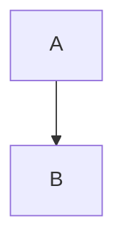


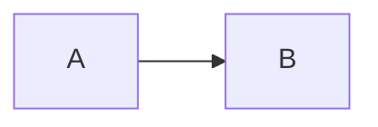

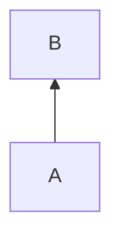

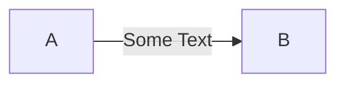

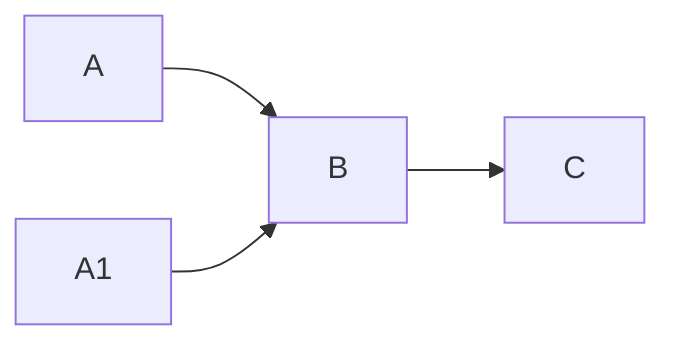

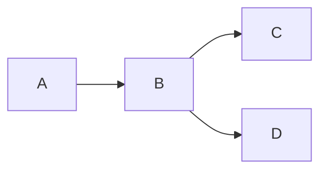

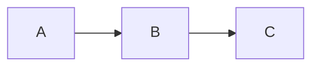

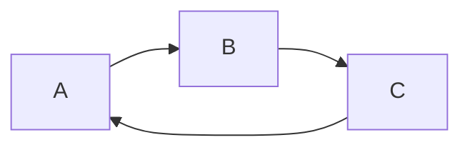

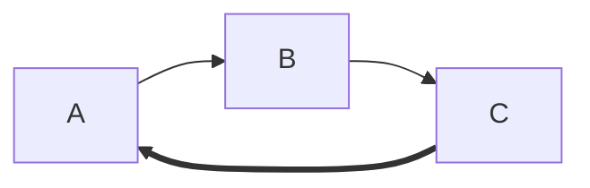


# &

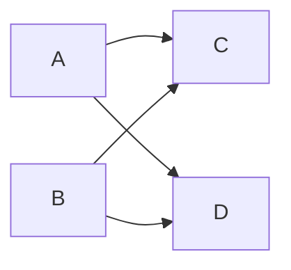

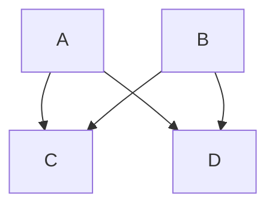


# Grouping
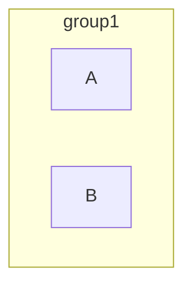

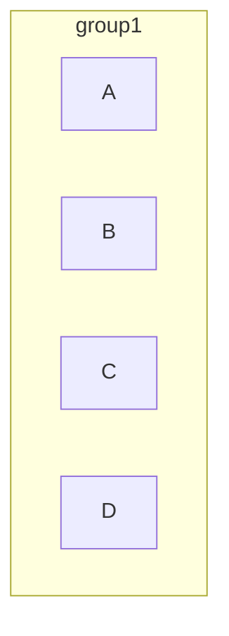

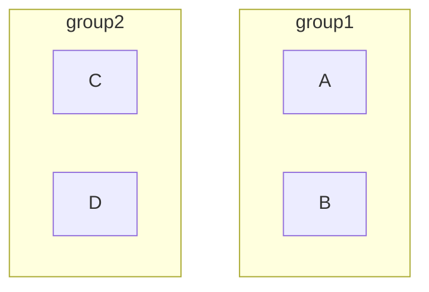

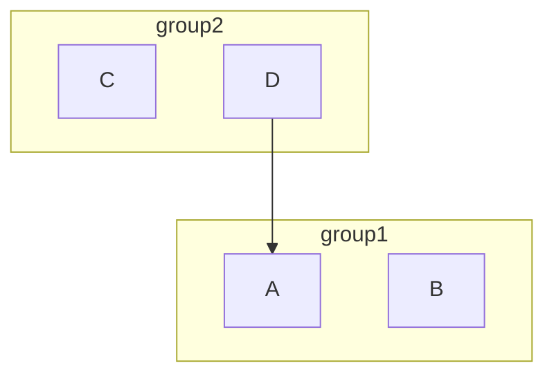

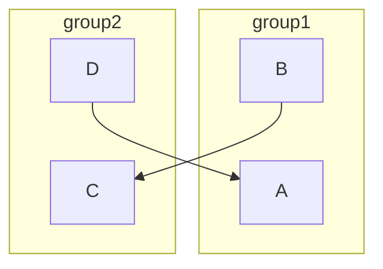

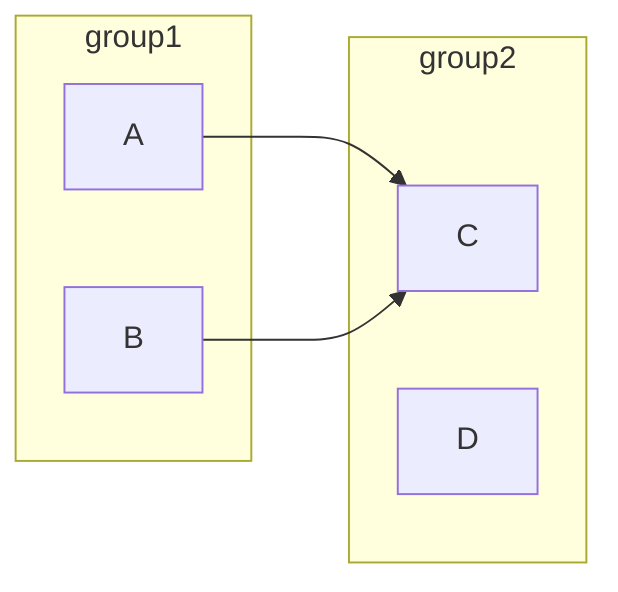

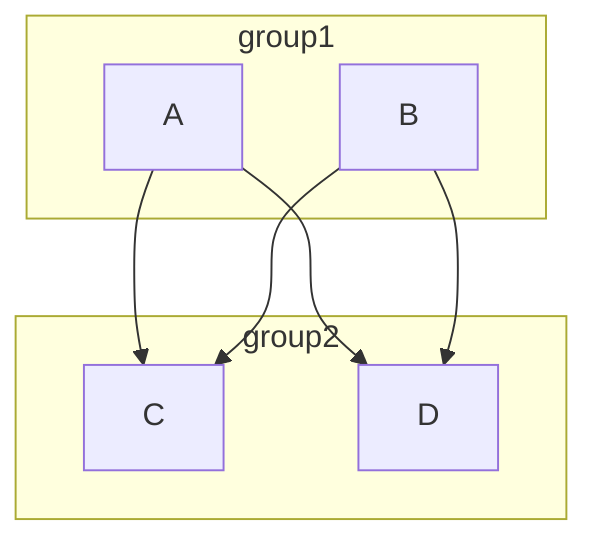


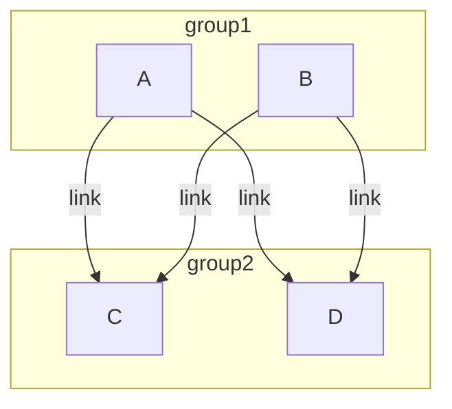

# To yourself 
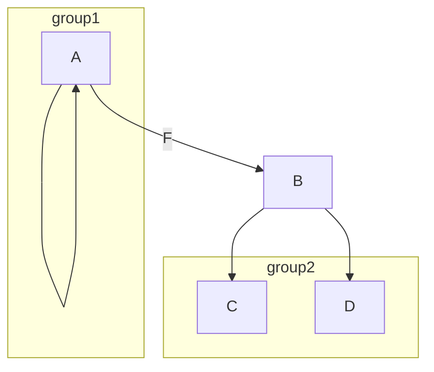

# ID-s
```mermaid
	graph LR
		id1[squared]
		id2(rounded)
		id3([round])
		id4[(cyclider)]
		id5((circle))
		id6{is it?}
```


# Scheme

```mermaid
	graph TD
		A[Start]-->B{Is it?};
		B --yes-->C[OK];
		C -->D[Rethink];
		D --> B;
		B ---->|NO| E[End];
		
		subgraph core logic
			B -- maybe -->M[Think]
		end  
		
```

```mermaid
	flowchart TB 
	c1-->a2 
	subgraph one 
	a1-->a2 
	end
	subgraph two
		b1-->b2 
	end
	subgraph three
		c1-->c2 
	end 
	one --> two
	three --> two
	two --> c2
```